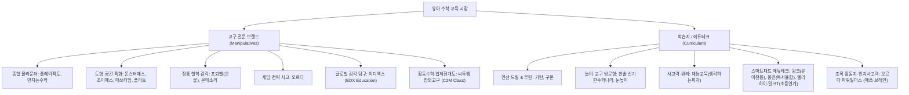

# 📊 한국 유아 수학 교구 및 학습지 브랜드 사전 조사 보고서

> **프로젝트 목표**: 수집된 데이터를 바탕으로 GitHub Pages 기반 인터랙티브 대시보드 구축  
> **조사 대상**: 국내 대표 유아 수학 교구 전문 기업 및 학습지/에듀테크 기업

---

## 1. 유아 수학 교구 전문 기업 (Manipulative & Play-based)

교구를 직접 손으로 만지고 조작(Manipulatives)하며 수학적 감각과 공간지각력, 개념 원리를 체득하도록 돕는 대표 기업 및 브랜드입니다.

| 기업/브랜드명 | 주요 제품/라인업 | 대상 연령 | 주요 특징 및 교육 방식 | 핵심 재질/형태 |
| :--- | :--- | :--- | :--- | :--- |
| **타임교육 C&P** (플레이팩토) | 플레이팩토 키즈 (STEP 1~3) 플레이팩토 먼슬리 플레이팩토 보드게임 | 4세 ~ 7세 (초등 연계) | • 국내 유아/초등 수학 교구 분야 최고 인지도 • 누리과정 및 초등 교과 연계 스토리텔링 활동북 + 원목/플라스틱 교구 세트 • 유아 수학 전 영역(수/연산, 도형, 규칙, 측정, 분류) 균형 설계 | 고급 원목, 플라스틱 조작 교구, 워크북 |
| **조이매스 (JoyMath)** | 칠교판, 패턴블록, 꼬마큐브 펜토미노, 지오보드, 수막대 하노이탑, 입체도형 세트 | 4세 ~ 초등 전 학년 | • 국내 정통 창의사고력 수학 교구 전문 브랜드 • 영역별 단품 교구 및 수준별 워크북 구매 용이 (가성비 우수) • 도형 감각, 공간지각력, 논리적 문제해결력 훈련에 최적화 | 원목 및 고강도 플라스틱, 워크북 |
| **오르다코리아 (Orda)** | 오르다 자석가베(M-Gabe) 사랑세트 / 창의세트 / 논리세트 (보드게임형 교구) | 4세 ~ 7세+ | • 이스라엘 유대인 하브루타 영재교육 철학 기반 • 회전식 자석을 적용한 혁신적 '자석가베'로 정교한 입체 조립 가능 • 게임 룰을 통해 전략적 사고와 수학적 논리력을 키우는 보드게임 세트 | 회전 자석 블록, 보드게임 교구, 가이드북 |
| **한국프뢰벨 (Froebel)** | 프뢰벨 은물 (Gabe 1~10) 프뢰벨 준은물 (1~8) 다중지능 수학동화 | 2세 ~ 7세 | • 독일 프리드리히 프뢰벨의 정통 교육 철학 구현 • 점, 선, 면, 입체의 기본 단위를 조합하며 공간/비례/건축 감각 체득 • 수학동화와 결합하여 자연스러운 수학적 어휘와 개념 노출 | 고급 원목(비치우드 등), 가이드북 |
| **키즈스콜레 (Kids' Schole)** | 만지는 수학 (스마트팩/플레이팩) 밤비노루크 / 미니루크 (LUK) | 3세 ~ 7세 | • '보고, 만지고, 느끼는' 감각 중심의 홈스쿨링 전문 프로그램 • 108가지 테마 놀이수학 및 원목 교구 활동 • 자가점검식 타일 퍼즐인 독일식 '루크(LUK)' 시스템 독점 유통 | 원목 교구, 조작형 타일, 놀이책, 영상 가이드 |
| **연두비** (몬테소리 매쓰) | 몬테소리 매쓰 19종 원목 교구 단계별 미션북 60권 (600 미션) 부모 가이드북 (Gonzagarredi 제휴) | 0세 ~ 7세 (권장 3~7세) | • 유럽 정통 몬테소리 수학교구 19종과 60권 미션북의 올인원 홈스쿨링 프로그램 • 수막대, 금색구슬, 세갱판, 분수원기둥으로 십진법 자릿값과 사칙연산의 직관적 물리화 • 오류 자동 정정(Self-Correction) 설계와 600개 단계별 미션으로 엄마표 자기주도 완주 | 최고급 원목 교구 19종, 미션북 60권, 가이드북 |
| **한국몬테소리 / 아가월드** | 몬테소리 수학 영역 교구 (수막대, 모래숫자판, 세강판, 비즈 구슬틀, 분수원반) | 3세 ~ 7세 | • 마리아 몬테소리의 감각 및 수학 교육 정통 교구 • 십진법, 자릿값, 연산 원리를 구슬과 막대로 시각적·물리적 직관화 • 자기 교정적(Self-correcting) 설계로 자율적 탐구 유도 | 원목, 금속, 구슬(비즈), 패브릭 |
| **매쓰타임 (MathTime)** | MTB 자석블록 (정다면체, 준정다면체, 기하구조) | 5세 ~ 초등/중등 | • 수학 기하학(Geometry) 및 입체 공간도형 전문 자석 교구 • 쇠구슬과 자석봉을 결합하여 프랙탈, 다면체, 공간 뼈대 구조 구현 • 초·중·고 기하 도형 학습까지 이어지는 높은 확장성 | 네오디뮴 자석봉, 쇠구슬, 워크시트 |
| **한립토이즈 (Hanlip Toys)** | 수세기 곰돌이/과일 카운터 수학 저울, 시계 교구, 연결큐브 | 3세 ~ 6세 | • 전국 국공립/사립 유치원 및 어린이집 표준 교구재 납품 1위 기업 • 분류, 짝짓기, 수량 비교, 균형 감각을 익히는 기초 교구 다수 • 안전성 검증 및 뛰어난 내구성, 합리적인 단품 가격 | 친환경 플라스틱, 논슬립 고무 |
| **시매쓰출판 (C-Math)** | 생각하는 유아수학 상위권수학960, 플라토(도형 교구재) | 5세 ~ 초등 | • 대형 사고력 수학 학원 시매쓰의 연구 개발 노하우 집약 • 단순 교구 조작을 넘어 지면 사고력 문제 해결로 이어지는 가교 역할 • 평면·입체 공간지각력을 단계별로 계발하는 '플라토' 시리즈 스테디셀러 | 활동지, 부록 조작물, 워크북 |
| **조이앤에듀 (몬스터매스)** | 몬스터매스 유아/초등 교구 챌린지 시리즈, 아레테(지면) 몬스터연산 | 5세 ~ 초등 저학년 | • 교구를 직접 조작하는 **구체적 사고** 후 지면(아레테)으로 개념을 일반화하는 **추상적 사고** 2단계 몰입 프로그램 • 펜토미노, 소마큐브, 하노이탑, 패턴블록 등 검증된 교구 활용 • 개정 교과 과정과 긴밀히 연계된 사고력/창의력 커리큘럼으로 가맹 공부방·학원 및 홈스쿨링에서 급성장 | 프리미엄 원목/특수 조작 교구, 단계별 교재 |
| **이디엑스 (EDX Education)** | 레인보우 조약돌 (Pebbles®) 수세기 곰돌이 & 수학저울 지오스틱 기하 세트, 링커큐브 | 3세 ~ 7세 (초등 연계) | • 전 세계 90개국 유치원·학교 표준으로 채택된 글로벌 1위 감각 조작 수학교구 • 부드러운 촉감의 조약돌로 색상·크기 분류, 패턴, 균형 감각을 놀이로 체득 • 곰돌이 무게 비례 저울과 지오스틱 각도 결합으로 수연산과 기하 직관 완성 | 친환경 무독성 소프트 수지, 고강도 플라스틱 |
| **씨투엠에듀 (C2M Class)** | 초등수학교구상자 12종 큐보이드(Cuboid 전개도) 플렉스지오, 텐블럭, 플레이메쓰 | 5세 ~ 초등 3학년 | • 팩토·1031·필즈수학 개발자 한헌조 소장의 20년 활동수학 노하우 집약 • 입체도형 11개 전개도를 직접 접고 펼치는 특허 교구 '큐보이드'로 공간도형 종결 • 킨더 활동수학 교구부터 초등 5대 영역 교구상자, 창의 보드게임까지 풀라인업 | 특허 입체 전개도 조작물, 원목 블록, 플라스틱 |
| **매스티안 (팩토슐레)** | 팩토슐레 5대 영역 교구 18종 STEAM 놀이 워크북 18권 스마트 사물인식(AR) 앱 | 4세 ~ 7세 | • 팩토 개발진이 만든 유아 전용 교구+워크북+스마트 앱 통합 프로그램 • 5대 영역 전용 교구 18종을 만지며 놀이하듯 수학 원리를 직관 체득 • 스마트폰/태블릿 앱이 교구를 사물 인식하여 실시간 힌트 및 상호작용 제공 | 친환경 교구 18종, 워크북, AR 앱 |
| **블루래빗 (Blue Rabbit)** | 수학시작 풀패키지 토끼펜(음원펜), 원목 셈틀 재밌다 수학 놀이책 | 만 2세 ~ 만 5세 | • 토끼펜(소리펜)으로 찍어 듣는 오감 자극 첫 수학 전집 • 글자를 모르는 아기도 소리와 음악으로 수량, 크기, 도형 개념 탐색 • 친환경 원목 셈틀(주판)과 비즈 롤러코스터로 소근육과 수량 감각 동시 발달 | 토끼펜, 원목 셈틀, 보드북, 스티커 놀이책 |

---

## 2. 유아 수학 학습지 및 에듀테크 기업 (Workbooks & EdTech)

체계적인 커리큘럼, 연산 훈련, 학습 습관 형성 및 방문교사/패드 기반 관리를 제공하는 대표 기업입니다.

| 기업/브랜드명 | 주요 상품 | 학습 방식 | 주요 특징 및 장단점 | 가격대/과금 방식 |
| :--- | :--- | :--- | :--- | :--- |
| **기탄교육** | 기탄수학 (A~N단계) 기탄 사고력수학 | 자가학습 (엄마표 홈스쿨링) | • **장점**: 압도적인 가성비, 세분화된 스몰스텝 반복 연산으로 계산력 완성 • **단점**: 부모의 직접적인 스케줄 관리 및 채점 필요, 반복에 따른 지루함 가능성 | 권당 5,000~7,000원선 (정기구독 부담 없음) |
| **교원구몬** | 구몬수학 스마트구몬N 유아 | 주 1회 방문 관리 + 매일 지면/패드 풀이 | • **장점**: 매일 1~3장씩 정해진 분량을 푸는 강력한 공부 습관 형성, 독보적 연산 정확도/속도 • **단점**: 기계적 반복 중심이라 응용/사고력 영역 부족, 아이의 흥미 저하 위험 | 월 4~5만원대 (과목당) |
| **대교 눈높이** | 눈높이놀이수학 눈높이수학 눈높이스마트수학 | 주 1회 방문 / 러닝센터 + 온오프 결합 | • **장점**: 유아 단계에 맞는 다채로운 스티커/조작 활동북, 연산과 개념의 적절한 균형 • **단점**: 담당 교사의 역량에 따른 학습 편차, 장기 유지 시 가격 부담 | 월 4~5만원대 (과목당) |
| **한솔교육** | 신기한 수학나라 (놀이수학) | 주 1회 방문 교사 + 전용 교구 활용 | • **장점**: 교구(피싱블록, 입체조작물)와 스토리텔링 동화, 교사 수업이 완벽히 결합 • **단점**: 교구 풀세트 구매 시 초기 비용 발생, 6~7세 이후 연산 심화 연계 필요 | 초기 교구비 별도 + 월 수업료 5~7만원선 |
| **재능교육** | 재능스스로수학 생각하는 피자(사고력) | 주 1회 방문 관리 + 자가 진단평가 | • **장점**: 스스로학습 진단 처방, 기계적 연산보다 원리 이해 및 사고력 비중이 높음 • **단점**: 방문 교사 수업 시간이 짧음, 자기주도성이 없는 유아는 밀리기 쉬움 | 월 4~5만원대 (과목당) |
| **단비교육** | 윙크 (Wink) 유아수학 | 전용 태블릿 + 매월 실물 지면교재 배송 (화상코칭 옵션) | • **장점**: 4~7세 유아 눈높이에 특화된 애니메이션/게임 콘텐츠로 거부감 없는 진입, 실물 교재 병행 • **단점**: 미디어 화면 노출 시간 증가, 장기 약정(1~2년) 구조 | 월 9~11만원선 (한글/수학/영어 종합) |
| **웅진씽크빅** | 웅진 스마트올 키즈 씽크빅 바로셈 / 셈셈수학 | 스마트패드 + 방문 관리 / 북클럽 연계 | • **장점**: 방대한 도서/독서 연계 콘텐츠, AI 분석을 통한 개인 맞춤형 진도 설계 • **단점**: 약정 위약금 및 초기 기기 비용 부담, 콘텐츠 과다로 집중 분산 가능성 | 월 10~13만원선 (종합 패키지 약정형) |
| **천재교육 / 메가스터디** | 밀크T아이 (천재) 엘리하이 키즈 (메가) | 전용 태블릿 + 실물 지면학습지 + 교구 팩 | • **장점**: 초등 1등 교육기업들의 프리미엄 콘텐츠, 초등 교과 과정과의 자연스러운 연계 • **단점**: 유아에게 다소 이른 학습 부담감 가능성, 고가의 장기 약정 | 월 10~14만원선 (종합 패키지 약정형) |
| **오르다코리아** (파워빌더스) | 매쓰파워빌더스 (Step 1~3) 브레인파워빌더스 (4세/Step 1~3) | 방문 1:1 교사 관리 / 센터 + 활동지 & 전용 조작 교구 | • **장점**: 미국 NCTM 5대 수학 영역 완전 연계, M-블록·수트랙 등 실물 교구 조작 후 지면 활동지로 이어지는 완벽한 개념 정착, 유대인식 하브루타 논리사고력 자극 • **단점**: 방문 교사 수업 의존도가 높아 홈스쿨링 시 부모의 정교한 발문 가이드 숙지 필요, 세트 구매 비용 | 월 수업료 10~15만원선 + 교구/활동지 세트 |
| **마이리틀타이거** (삼성출판사) | 타이거 수학홈스쿨 (만2~5세) 첫 연산놀이 워크북 수학타이거 개념24 전집 | 100% 가정 자율 학습 (엄마표 분권형 세트) | • **장점**: 초가성비 국민 워크북, 핑크퐁/타이거 캐릭터와 풍성한 스티커로 아이 자발적 흥미 유발, 거부감 제로 • **단점**: 유아 기초 감각 형성에 최적화되어 있어 초등 고난도 심화나 경시대회형 사고력 연계는 한계 | 세트당 3만~4만원선 (전집 20만원대) |

---

## 3. 브랜드별 핵심 차별성 (Core Differentiation) 심층 분석

학부모들이 아이 성향과 교육 목표에 맞춰 선택할 때 결정적인 기준이 되는 각 브랜드의 고유 DNA 및 차별점입니다.

### 🧩 [교구 전문 기업 차별성]

| 브랜드 | 핵심 포커스 (Core Focus) | 결정적 차별화 포인트 (Killer Differentiation) |
| :--- | :--- | :--- |
| **몬스터매스** | **도형·공간지각력 특화** (Geometry First) | • *"도형은 몬스터매스"*라는 인식이 확고할 만큼 **평면·입체 공간도형 및 교구 조작에 압도적 집중** • 구체물(소마큐브, 펜토미노, 패턴블록 등)을 만지는 '구체적 사고' 직후, **자체 지면 교재인 '아레테(ARETE)'**를 통해 개념을 일반화·추상화하는 **2단계 브릿지 시스템**이 독보적 |
| **플레이팩토 키즈** | **초등 교과 5대 영역 올라운더** (All-in-One Curriculum) | • 특정 영역에 편중되지 않고 **수/연산, 도형, 측정, 규칙성, 자료/가능성** 5개 교과 영역을 골고루 완벽 커버 • 누리과정 및 초등 1~2학년 교과와의 직결도가 가장 높아 **초등학교 입학 준비 교구로 1위 선호도** |
| **조이매스** | **필요한 영역만 골라 담는 모듈형** (Modularity & High Value) | • 수백만 원대 전집을 살 필요 없이 칠교판, 지오보드, 수막대 등 **원하는 교구를 1~2만 원대에 단품 구매 가능** • 각 교구마다 수준별 워크북이 탄탄하여 **특정 취약 영역(예: 칠교, 입체도형)을 핀포인트로 훈련**하기에 최고의 가성비 |
| **오르다** | **회전 자석가베 + 게임식 전략 사고** (Magnetic Gabe & Boardgame) | • 일반 가베의 무너지기 쉬운 단점을 **360도 회전 자석(특허)**으로 해결하여 정교한 입체 조립 가능 • 단순 문제풀이가 아닌 **룰 기반 보드게임(사랑/창의/논리 세트)**을 통해 상대의 수를 읽고 전략을 짜는 **하브루타식 대결/협력 게임** |
| **프뢰벨 은물** | **점·선·면·입체의 철학적 해체** (Architectural & Creative) | • 계산이나 연산이 아닌 **'세상을 이루는 기하학적 기본 단위'**로 접근 • 1~10 은물을 자르고 붙이지 않고 온전히 해체·재구성하며 **건축적 구조 감각, 비례감, 창의적 조형미** 체득 |
| **키즈스콜레 만지는수학** | **자가점검 루크 타일 + 발문 코칭** (Self-Checking & Questioning) | • 부모가 채점하지 않아도 아이가 타일을 뒤집어 뒷면 무늬로 즉시 정답을 맞추는 **독일식 루크(LUK) 시스템** • 부모가 아이에게 던져야 할 유도 질문 매뉴얼(**'발문의 기술'**)이 상세히 제공되어 홈스쿨링 부담 완화 |
| **연두비 몬테소리 매쓰** | **유럽 정통 교구 19종 + 600개 미션북** (19 Montessori Tools & 600 Missions) | • 유럽 정통 AMI 공인 몬테소리 수학교구 19종과 60권의 체계적인 미션북(총 600개 미션) 풀패키지 • 수막대, 금색구슬, 세갱판, 분수원기둥을 통해 **자릿값과 사칙연산, 기하를 손으로 체화** • 교구 자체의 **오류 자동 정정 기능**과 부모 가이드북을 결합하여 **방문교사 없이도 엄마표 자기주도 완주 가능** |
| **한국몬테소리** | **십진법 자릿값의 물리적 체감** (Sensory Decimals & Self-correction) | • 1(낱개 구슬), 10(막대), 100(판), 1,000(정육면체 큐브)을 통해 **1000이 1보다 얼마나 무겁고 큰지 무게와 부피로 체득** • 틀리면 다음 단계로 블록이 들어가지 않는 **'오류의 통제'** 기능으로 스스로 정답을 찾아가는 자율성 |
| **매쓰타임 MTB** | **3차원 뼈대 구조 기하학 전문** (Frame-based 3D Geometry) | • 면으로 막힌 블록이 아닌, 자석봉과 쇠구슬로 모서리와 꼭짓점을 잇는 **뼈대(Frame) 구조** • 정다면체, 준정다면체, 프랙탈, 축구공 구조 등 **중·고등 기하학까지 무한 확장** 가능한 독보적 기하 교구 |
| **시매쓰 (플라토)** | **영재/심화 사고력 도약 브릿지** (Advanced Thinking & Plato) | • 교구 놀이 단계에서 멈추지 않고 상위권 경시대회/영재 사고력 지면 문제로 연결 • 특히 공간도형 전문 지면 드릴인 **'플라토(Plato)'**는 도형 분야 국내 1위 교재로 자리매김 |
| **이디엑스 (EDX)** | **글로벌 No.1 감각 조작 & 높은 가성비** (Sensory Play & High Value) | • 전 세계 90개국 유아 교육기관 표준 교구 (레인보우 조약돌, 곰돌이 저울, 지오스틱) • 비싼 전집 대신 2~3만원대 단품으로 수세기, 색상/패턴 분류, 무게 비례, 평면 기하 직관을 완벽 체득 |
| **씨투엠 창의교구** | **입체 전개도(큐보이드) & 12종 활동교구** (Cuboid Net & Activity Manipulatives) | • 팩토·1031 개발자 한헌조 소장의 노하우가 담긴 12개 테마 활동수학 교구 세트 • 정육면체 11가지 전개도를 접고 펼치는 특허 교구 **'큐보이드'**와 텐블럭으로 초등 교과 기하·연산 완전 정복 |

---

### 📚 [학습지 및 에듀테크 기업 차별성]

| 브랜드 | 핵심 포커스 (Core Focus) | 결정적 차별화 포인트 (Killer Differentiation) |
| :--- | :--- | :--- |
| **기탄수학** | **극강의 반복 연산 드릴 & 최저가** (Calculation Speed & Cost-efficiency) | • 사고력이나 스토리텔링 없이 오직 **'빠르고 정확한 연산력' 하나에만 집중한 스몰스텝 무한 반복** • 권당 5~7천 원대의 압도적 가격 경쟁력으로 홈스쿨링 엄마표 연산의 국민 교재 |
| **교원구몬** | **매일 15분 공부 루틴 & 선행 진도** (Daily Routine & Ahead Progress) | • 일일 학습지 풀이를 통한 **타협 없는 매일 공부 습관 형성** • 아이 능력에 맞춰 학년에 얽매이지 않고 초등·중등 연산까지 앞서 나가는 **선행 진도 시스템** |
| **대교 눈높이** | **스티커/조작 놀이수학 & 러닝센터** (Play Math Balance & Learning Center) | • 스티커 붙이기, 색칠하기 등 유아 친화적 교재로 **공부에 대한 거부감 최소화** (연산과 개념의 조화) • 가정 방문뿐 아니라 동네 전문 학원형인 **'눈높이 러닝센터'** 등원 학습 선택 가능 |
| **한솔 신기한수학나라** | **교구 + 스토리텔링 동화 + 방문 수업** (Tangible Storytelling Tutoring) | • 지면 학습지만 푸는 지루함을 없애고, **방문 교사가 매주 피싱블록/입체 모형 등 전용 교구를 들고 와 놀이식 수업** • 4~5세 유아가 수학을 '놀이'로 처음 받아들이기에 가장 최적화 |
| **재능교육** | **원리 이해 & 사고력 '생각하는 피자'** (Conceptual Understanding & Pizza) | • 기계적 연산 암산을 지양하고 **'왜 그렇게 계산되는지' 원리 탐구**를 강조 • 연산 외에 공간지각, 논리추론, 창의성을 총망라한 **국내 최고 수준의 사고력 교재 '생각하는 피자'** 보유 |
| **단비교육 (윙크)** | **유아 전용 애니메이션 + 실물 교재** (Early Childhood Native & Hybrid) | • 초등용을 유아로 낮춘 것이 아니라 **처음부터 4~7세 유아 발달에 맞춰 개발**되어 몰입감 최고 • 패드 영상에만 의존하지 않고 **매월 손글씨로 직접 쓰는 실물 지면 학습지를 집으로 배송**하는 완벽한 하이브리드 |
| **웅진 스마트올** | **방대한 전집 라이브러리 독서 융합** (Bookclub Reading Integration) | • 수학 문제풀이에 국한되지 않고 **웅진의 방대한 수학 그림책/전집 라이브러리를 무제한 읽으며 개념 체득** • AI 분석을 통해 취약 개념을 진단하고 맞춤형 문항 처방 |
| **엘리하이키즈 / 밀크T아이** | **초등 1등 교육기업의 프리미엄 연계** (Elementary Ready Premium) | • 메가스터디/천재교육의 검증된 강사진과 최첨단 인터랙티브 멀티미디어 • 초등학교 1학년 교과서와 완벽히 이어지는 **초등 입학 전 가장 확실한 교과 선행·예습력** |
| **오르다 파워빌더스** | **NCTM 5대 영역 & 인지사고력 활동지** (NCTM 5 Standards & Brain Logic) | • 미국 수학교사협의회(NCTM)의 5대 수학 영역(수연산, 대수, 기하, 측정, 자료분석)을 교구와 활동지로 빈틈없이 연결 • 두뇌 전반의 인지 유추·범주화·공간회전을 훈련하는 **'브레인파워'**와 수학 5대 영역을 심화하는 **'매쓰파워'**의 듀얼 통합 시스템 |

---

## 4. 대시보드 구축을 위한 비교 매트릭스 & 분류 체계

향후 GitHub Pages 대시보드(필터링, 검색, 비교 차트 등)에 활용할 데이터 속성 분류:

### 대시보드 필터 항목 제안:
1. **카테고리**: 교구 전문 / 정통 철학 / 전통 학습지 / 에듀테크 패드
2. **핵심 포커스(Core Focus)**: 도형·공간 특화 / 초등 교과 올라운더 / 연산 드릴 / 게임·전략 사고 / 정통 감각 / 독서 융합
3. **대상 연령**: 3~4세(입문) / 5~6세(발달) / 7세(초등 연계)
4. **학습 방식**: 부모 지도(엄마표) / 자율 탐구 / 방문 교사 / 스마트 기기
5. **가격 체계**: 저가형(단품/자가) / 구독형(월정액) / 고가 전집·세트형
